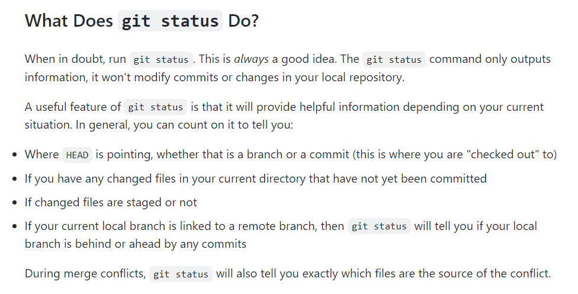
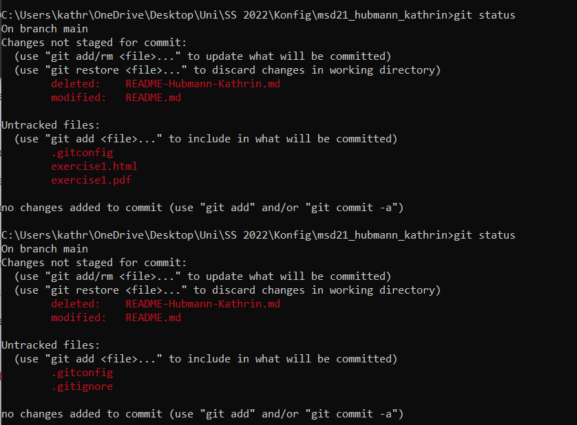
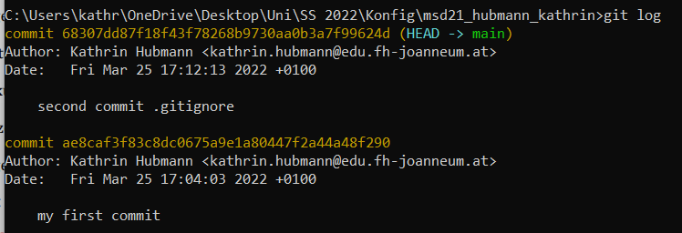

# git Commands

## git config
Get and set repository or global options

## git init
turns any directory into a git repository;

initialises the repository and creates a hidden directory called .git

## git commit
creates a commit -> is a version of the repository at a specific time (the time of the commit);

commits also include metadata like author, time, date, ...

## git status
shows current state of repository

## git add
adds new files or changes to existing ones -> is also needed so a commit can work

## git log
shows the commit logs (history of all the commits) in chronological order

## git diff
shows the changes between the commits

## git pull
updates all working branches (local and remote ones)

## git push
uploads all changes of the local branch to the remote one