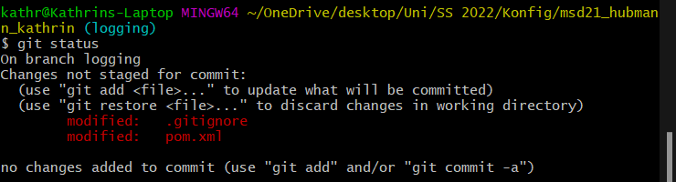
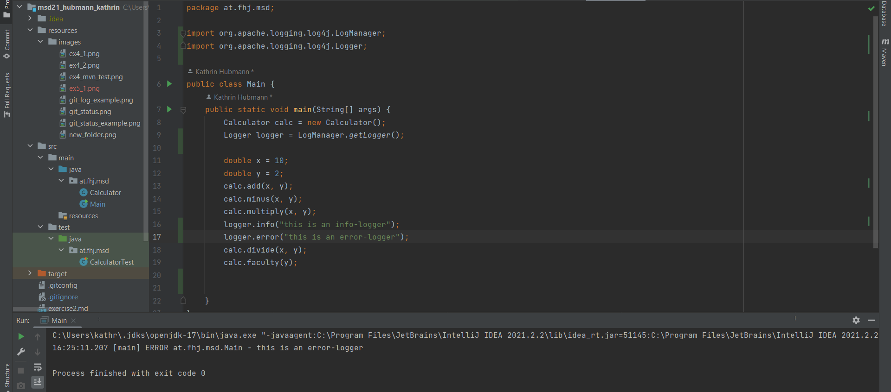

## Exercise 5

## Documentation

here are the screenshots made in this exercise

git status:

logger:

log-file:

git status 2nd time:

## Logging

### Why use logging libraries

Logs are used to help you to analyze the code flow and 
catch if there is any unexpected result or break in the 
flow. Logs are very important for development, testing, 
and finding the occurrence of a problem later.

### Logging levels

There are 7 different logging levels (in ascending order):

1. ALL - to log all events
2. TRACE - capture the flow throughout te application
3. DEBUG - general debugging event
4. INFO - informational purpose
5. WARN - might lead to an error
6. ERROR - an error in the application
7. FATAL - severe error, which will keep the application from continuing

If we say our root level is "warn" then warn, error and 
fatal will be logged, but if we say "debug" then debug, 
info, warn, error and fatal will be logged - so you say 
the least important you want to still be logged and 
everything more important will be logged as well.

### Configuration possibilities with log4j

You can specify configurations with an XML, JSON or YAML 
configuration file. If log4j can't find a configuration 
file it will use default configurations. In order for 
log4j to find the configuration file it has to bi in the 
resources directory in the main directory.